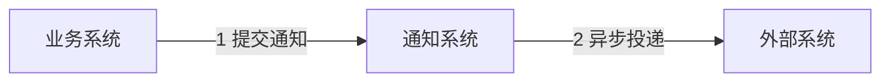
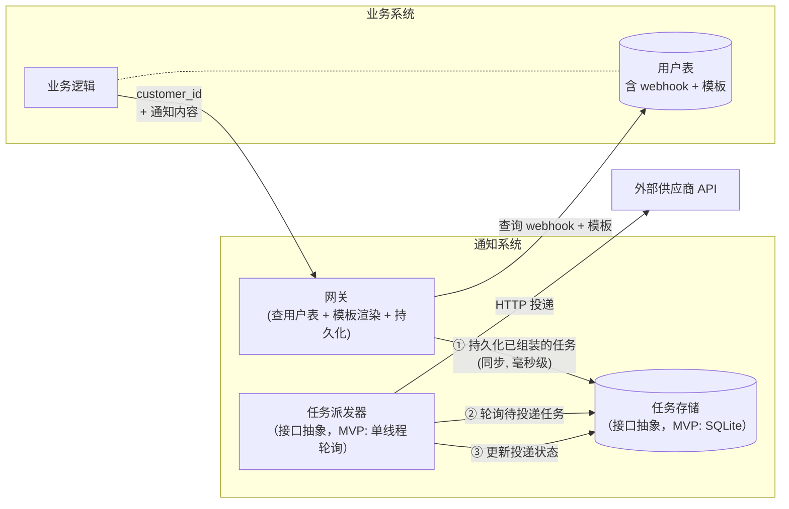
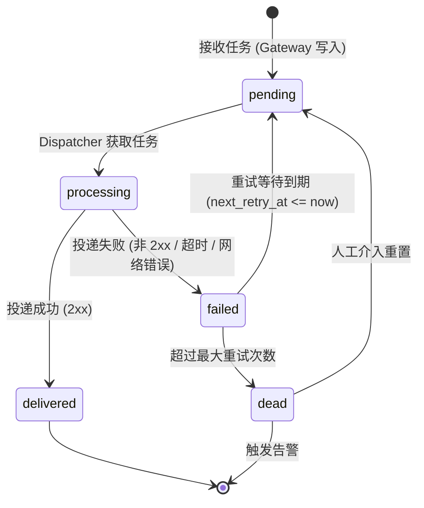

# API Notification System

## 问题理解

典型场景如下：



通知系统作为内部平台服务，接收业务系统提交的通知请求，异步投递到外部客户（Customer）API。整个过程分为两个阶段：

- **接收阶段（1）**：同步，毫秒级返回。业务系统只需确认"通知已被接受"（`202 Accepted`），无需等待投递结果。
- **投递阶段（2）**：异步，通知系统独立负责最终送达。外部 API 的抖动与不可用不影响业务系统的正常运行。

这个两阶段解耦是系统最核心的设计选择。

需要关注的核心问题：

1. **投递可靠性**：采用「至少一次」投递策略，确保消息最终送达。
2. **重试与失败处理**：投递失败时按指数退避策略重试；超过最大重试次数后进入死信状态，触发告警，等待人工介入。
3. **Customer 适配**：不同外部系统的请求地址、Header、Body 格式各不相同。业务系统只需传入客户 ID 与通知内容，**由通知系统负责查询用户表获取 webhook 配置，完成消息体组装后投递**。
4. **可扩展性**：DB 和任务队列模块封装为可插拔接口，不绑定特定中间件，以复用已有基础设施。

### 关于 Customer 配置的归属

Customer 的 webhook 地址、请求体模板等信息，是业务系统在注册客户时已经产生的固有信息，存储在用户表中。通知系统在接收通知请求时，通过 `customer_id` 查询用户表获取对应的 webhook 配置，完成消息组装后持久化任务。通知系统**不维护独立的 Customer 配置表，也不需要为此搭建独立的配置管理鉴权体系**；配置的源头和更新职责在业务系统侧。

**关于"组装时机"的设计选择**：在 Gateway 接收请求时（提交阶段）完成模板渲染，将组装好的完整 HTTP 请求存入 `notification_jobs`，而非在 Dispatcher 投递时再查表渲染。好处是 Dispatcher 保持简单、无需访问用户表，且重试行为完全可预期（每次投递内容一致）。已知局限：若认证 Token 在重试窗口内过期，后续重试会失败，MVP 阶段接受这一限制。

### 关于消息去重的范围界定

需区分三个不同层次的"去重"，不可混淆：

| 层次 | 描述 | 谁负责 |
|---|---|---|
| **提交幂等** | 业务系统因重试等原因重复提交同一通知 | 本系统，通过可选的 `idempotency_key` 字段在接收层去重 |
| **系统内并发去重** | 同一任务被多个 Worker 同时处理 | 本系统，通过任务队列的独占获取机制保证（MVP 单线程天然避免） |
| **Customer 端幂等** | 因重试导致 Customer 收到重复通知 | Customer API 自身，本系统通过可选的 `idempotency_key` 透传辅助 |

至少一次语义意味着：若 Worker 在投递成功后、更新状态前崩溃，任务会被重试，Customer 可能收到重复通知。通过要求 Customer 支持幂等接口（并透传 `idempotency_key`）来缓解，本系统保留在接收层基于 `idempotency_key` 做精确一次提交的扩展点。


## 整体架构与核心设计

整体架构如下：



实线为 MVP 核心路径。DB 和任务派发器均通过接口抽象，未来可按需替换为更高吞吐的实现。

### 核心组件

**Gateway（接入层 + 消息组装）**
- 接收业务系统的 HTTP 请求，校验必填字段
- 若请求携带 `idempotency_key`，检查是否已存在相同 key 的任务，若存在则直接返回（扩展点：精确一次提交）
- 通过 `CustomerRepository` 接口查询用户表，获取目标客户的 webhook URL、Headers 模板、Body 模板
- 使用 Jinja2 将模板与通知内容（`title`、`content`）渲染为最终的 `target_url`、`headers`、`body`
- 将组装完毕的任务持久化后立即返回 `202 Accepted` 和 `job_id`

**Repository / DB（持久化层）**
- 通过 `NotificationRepository` 接口抽象，不绑定特定数据库
- 存储通知任务（`notification_jobs`）及其完整生命周期状态
- MVP 阶段使用 SQLite，配合单线程 Dispatcher 无需行级锁

**Dispatcher（任务派发层）**
- 通过 `TaskQueue` 接口轮询或订阅待投递任务
- MVP 阶段：单线程轮询，每隔固定间隔查询 `status IN ('pending', 'failed') AND next_retry_at <= now`
- 使用任务中已存储的 `target_url`、`headers`、`body` 直接发起 HTTP 调用（无需再次访问用户表）
- 按结果通过 `ack` / `nack` 更新任务状态
- 启动时将滞留的 `processing` 状态任务重置为 `pending`（处理上次崩溃残留）

**CustomerRepository（用户表访问层）**
- 通过接口抽象，屏蔽用户表的具体访问方式（直连 DB 或调用业务系统 API）
- MVP 阶段假设通知系统与业务系统共享数据库，直接读取用户表

### 接口抽象设计

```python
class CustomerWebhookConfig(TypedDict):
    endpoint_url: str
    http_method: str          # 默认 POST
    headers_template: str     # Jinja2 模板，渲染后得到 JSON 字符串
    body_template: str        # Jinja2 模板，渲染后得到请求体字符串
    timeout_seconds: int      # 默认 30
    max_retries: int          # 默认 10


class CustomerRepository(Protocol):
    """用户 webhook 配置的访问接口，屏蔽底层数据源"""

    def get_webhook_config(self, customer_id: str) -> CustomerWebhookConfig | None: ...


class NotificationRepository(Protocol):
    """通知任务的持久化接口，不绑定特定数据库"""

    def create(self, job: NotificationJob) -> str: ...
    def get_by_id(self, job_id: str) -> NotificationJob | None: ...
    def get_by_idempotency_key(self, key: str) -> NotificationJob | None: ...
    def update(self, job_id: str, **fields) -> None: ...


class TaskQueue(Protocol):
    """任务队列接口，支持 DB 轮询或外部消息队列两种实现"""

    def poll(self, batch_size: int) -> list[NotificationJob]:
        """获取一批待处理任务，实现层需保证同一任务不被并发获取"""
        ...

    def ack(self, job_id: str) -> None:
        """标记任务投递成功"""
        ...

    def nack(self, job_id: str, retry_at: datetime, error: str) -> None:
        """标记任务投递失败，设置下次重试时间"""
        ...

    def dead(self, job_id: str, error: str) -> None:
        """标记任务超出重试次数，进入死信状态"""
        ...
```

**`DBTaskQueue`（MVP 默认实现）**：基于 `notification_jobs` 表轮询，单线程运行，无并发竞争，SQLite 文件锁足够。若未来需要多实例并发，可针对目标数据库（MySQL 8.0+ / PostgreSQL）使用 `SELECT FOR UPDATE SKIP LOCKED`，或切换为 `RedisTaskQueue` / `RabbitMQTaskQueue`，Worker 代码无需修改。

### 任务状态机



启动恢复：系统启动时将超过一定时间未完成的 `processing` 状态任务重置为 `pending`，防止崩溃后任务卡死。

### 数据模型

通知系统只维护一张核心表。`notification_jobs` 存储 Gateway 组装完毕的完整 HTTP 请求快照，Dispatcher 无需再访问用户表：

```sql
CREATE TABLE notification_jobs (
    id               TEXT        PRIMARY KEY,          -- UUID
    -- 已组装的投递目标（Gateway 渲染模板后写入）
    target_url       TEXT        NOT NULL,
    http_method      TEXT        NOT NULL DEFAULT 'POST',
    headers          TEXT        NOT NULL DEFAULT '{}', -- JSON 字符串，兼容各数据库
    body             TEXT,

    -- 幂等与追踪
    idempotency_key  TEXT        UNIQUE,               -- 可选，用于提交去重
    customer_id      TEXT        NOT NULL,             -- 保留原始 customer_id，便于审计
    event_type       TEXT,                             -- 可选，仅用于日志追踪

    -- 状态与重试
    status           TEXT        NOT NULL DEFAULT 'pending',
                     -- pending | processing | delivered | failed | dead
    attempt_count    INTEGER     NOT NULL DEFAULT 0,
    max_attempts     INTEGER     NOT NULL DEFAULT 10,
    next_retry_at    DATETIME    NOT NULL,
    last_error       TEXT,

    created_at       DATETIME    NOT NULL,
    updated_at       DATETIME    NOT NULL
);

-- Dispatcher 轮询索引
CREATE INDEX idx_jobs_poll ON notification_jobs (status, next_retry_at);
```

> `headers` 存为 JSON 字符串而非数据库原生 JSON 类型，以保持对 SQLite 及旧版 MySQL 的兼容性，应用层负责序列化/反序列化。

### 业务系统数据表

以下表由**业务系统**负责创建和维护，通知系统对其只有只读权限。MVP 阶段两者共享同一 SQLite 文件；生产环境中可通过替换 `CustomerRepository` 实现改为 API 调用或独立数据库连接。

```sql
-- 客户表
-- 业务系统在客户注册流程中写入 webhook 配置字段。
-- 通知系统通过 customer_id 查询此表获取投递端点与模板信息。
CREATE TABLE customers (
    id    TEXT PRIMARY KEY,
    name  TEXT NOT NULL,
    email TEXT,

    -- ── Webhook 配置（通知系统只读）────────────────────────────────────────
    --
    -- webhook_url：投递目标地址。NULL 表示该客户未配置 webhook，
    --   Gateway 收到对应 customer_id 的通知请求时返回 400。
    webhook_url          TEXT,

    -- webhook_method：HTTP 方法，通常为 POST。
    webhook_method       TEXT    NOT NULL DEFAULT 'POST',

    -- webhook_headers_tpl：Headers 的 Jinja2 模板，渲染后须为合法 JSON 对象。
    --   可用变量：{{ customer_id }}、{{ title }}、{{ content }}
    --   示例：{"Content-Type": "application/json", "X-Source": "{{ customer_id }}"}
    webhook_headers_tpl  TEXT    NOT NULL DEFAULT '{"Content-Type": "application/json"}',

    -- webhook_body_tpl：请求体的 Jinja2 模板。
    --   可用变量：{{ customer_id }}、{{ title }}、{{ content }}（dict）
    --   支持 | tojson 过滤器将 Python 对象序列化为 JSON 字面量。
    --   示例：{"event": "{{ title }}", "data": {{ content | tojson }}}
    webhook_body_tpl     TEXT,

    -- webhook_timeout_s：单次 HTTP 请求超时时间（秒）。
    webhook_timeout_s    INTEGER NOT NULL DEFAULT 30,

    -- webhook_max_retries：最大重试次数，超出后任务进入 dead 状态触发告警。
    webhook_max_retries  INTEGER NOT NULL DEFAULT 10,

    created_at  DATETIME NOT NULL DEFAULT CURRENT_TIMESTAMP,
    updated_at  DATETIME NOT NULL DEFAULT CURRENT_TIMESTAMP
);
```

**字段说明补充：`webhook_body_tpl` 模板示例**

```
-- 广告平台转化回调（访问 content 中的具体字段）：
{"event_type": "{{ title }}", "user_id": "{{ content.user_id }}", "channel": "{{ content.channel | default('organic') }}"}

-- CRM 订阅更新（将整个 content 内嵌为 JSON 对象）：
{"action": "{{ title }}", "contact": {"email": "{{ content.email }}"}, "metadata": {{ content | tojson }}}
```

### API 约定

**提交通知（业务系统调用）**

```
POST /api/v1/notifications
Content-Type: application/json

{
  "customer_id":     "cust_123",          // 必填，用于查询 webhook 配置
  "title":           "Payment Success",   // 可选，通知标题，注入模板变量
  "content": {                            // 可选，通知正文，结构由业务决定
    "amount":        100.00,
    "currency":      "USD",
    "order_id":      "ord_456"
  },
  "idempotency_key": "biz-event-uuid-abc123",  // 可选，用于提交去重
  "event_type":      "payment_success"         // 可选，仅用于日志追踪
}

// 成功响应（新任务）：
HTTP 202 Accepted
{ "job_id": "550e8400-e29b-41d4-a716-446655440000", "status": "pending" }

// 幂等响应（idempotency_key 已存在，扩展点）：
HTTP 200 OK
{ "job_id": "已有任务的 ID", "status": "delivered" }

// customer_id 不存在或无 webhook 配置：
HTTP 400 Bad Request
{ "error": "no webhook config found for customer: cust_123" }
```

**Body 模板示例**（存储于用户表，Gateway 渲染时注入）：

```
// 用户表中的 body_template 字段示例：
{
  "event":     "{{ title }}",
  "user_id":   "{{ content.user_id }}",
  "amount":    {{ content.amount }},
  "timestamp": "{{ now_iso }}"
}
```

**查询投递状态（用于排查问题）**

```
GET /api/v1/notifications/{job_id}

HTTP 200 OK
{
  "job_id":        "550e8400-e29b-41d4-a716-446655440000",
  "customer_id":   "cust_123",
  "status":        "failed",
  "attempt_count": 3,
  "next_retry_at": "2024-01-01T11:30:00Z",
  "last_error":    "connection timeout after 30s"
}
```

### 投递重试策略（指数退避）

公式：`wait = min(2^attempt 分钟, 12小时)`，附加 ±10% 随机抖动（jitter）避免惊群效应。

| 尝试次数 | 间隔等待时间 |
|---------|------------|
| 1 | ~1 分钟 |
| 2 | ~2 分钟 |
| 3 | ~4 分钟 |
| 4 | ~8 分钟 |
| 5 | ~16 分钟 |
| 6 | ~32 分钟 |
| 7 | ~1 小时 |
| 8 | ~2 小时 |
| 9 | ~6 小时 |
| 10 | ~12 小时 |
| > max_retries | 进入 `dead` 状态，触发告警 |

`max_retries` 可从用户表的 webhook 配置中继承，以适应不同 Customer 的可用性特征。


## 关键工程决策与取舍说明

### 1. 系统边界

**本系统解决的问题：**
- 接收业务系统的通知请求，查询用户表完成消息组装，持久化后快速返回（接收与投递解耦）
- 模板渲染：将通知标题/内容按用户表中的 Body/Header 模板渲染为最终请求
- 带指数退避的异步重试机制
- 死信任务的告警与人工重置能力
- 通过 `idempotency_key` 支持提交层去重（扩展点）
- 投递任务的全生命周期状态追踪

**明确不解决的问题（及原因）：**

| 问题 | 不解决的原因 |
|---|---|
| Customer 配置的维护与管理 | 属于业务系统注册流程的职责，配置源头和更新由业务系统负责 |
| 业务系统的认证/鉴权 | 假设内网可信环境，或由上层 API Gateway 统一处理 |
| Customer 端的幂等去重 | 需要 Customer API 配合，本系统通过透传 `idempotency_key` 辅助，无法单边保证 |
| Token 过期后的自动刷新 | 若认证 Token 在重试窗口内过期，重试将失败并最终进入死信；MVP 阶段接受这一限制，可在后续通过在 Dispatcher 侧动态获取 headers 解决 |
| 投递结果的回调通知给业务系统 | 需求明确"业务系统不关心返回值" |
| Payload 内容的业务校验 | 本系统是投递通道，不应嵌入业务语义 |

### 2. 投递语义与失败处理策略

**选择：At-Least-Once（至少一次）**

理由：
- 业务系统"只需确保通知能够被稳定、可靠地送达"，天然倾向最终一致
- Exactly-once 语义需要 Customer 端提供幂等接口，本系统无法单边保证
- 大多数外部通知场景（广告回调、CRM 状态变更）本身要求 Customer 做幂等设计，这是行业惯例

**扩展点：精确一次提交（Exactly-Once Submission）**

通过可选的 `idempotency_key` 字段，在接收层实现幂等提交：
- 业务系统为每次通知生成唯一 `idempotency_key`（如事件 UUID）
- Gateway 收到请求时检查 key 是否已存在，若存在则返回已有任务，不重复创建
- 这解决了业务系统因重试导致的重复提交问题
- 投递到 Customer 的幂等性仍依赖 Customer 端实现；本系统透传 `idempotency_key` 作为请求头（`X-Idempotency-Key`）供 Customer 使用

**外部系统长期不可用的处理策略：**
- 超过 `max_retries` 后任务置为 `dead`，停止消耗 Dispatcher 资源
- 通过告警（如钉钉 / PagerDuty）通知运维团队
- 支持通过管理接口将 `dead` 任务批量重置为 `pending`，在 Customer 恢复后重新投递
- MVP 阶段不实现自动熔断（Circuit Breaker）：初期运维团队对系统行为了解有限，自动熔断的阈值调优需要线上数据积累，人工观察 + 告警 + 介入更可控

### 3. DB 与任务派发器的选型策略

**MVP 选择：SQLite + 单线程 Dispatcher**

在明确接受"单线程派发"约束的前提下，SQLite 是合理的 MVP 起点：
- 单线程 Dispatcher 不存在并发竞争，无需 `SELECT FOR UPDATE SKIP LOCKED`，SQLite 文件锁足够
- 零额外基础设施：无需独立部署数据库服务，降低 MVP 的运维门槛
- 任务状态全部持久化在 SQLite 文件中，天然支持断点恢复

**为什么接受单线程约束（MVP 阶段）：**
- 对于低频通知场景（< 数百条/分钟），单线程完全够用
- 并发 Dispatcher 的并发安全设计应在有实际扩展需求时再引入，避免过早复杂化

**核心原则：接口抽象，不绑定实现**

`NotificationRepository`、`TaskQueue`、`CustomerRepository` 均以接口形式定义。升级路径清晰：

| 数据库 | TaskQueue 推荐实现 |
|---|---|
| SQLite（MVP） | 单线程轮询，无需行锁 |
| MySQL 8.0+ / PostgreSQL | `SELECT FOR UPDATE SKIP LOCKED` |
| MySQL 5.7 | 乐观锁：`UPDATE ... WHERE status='pending' LIMIT n`，检查影响行数 |
| Redis | `BLPOP` + 状态机管理 |
| RabbitMQ / 其他 MQ | 原生 ack/nack 语义 |

切换底层实现时，Gateway 和 Dispatcher 的核心逻辑无需修改。

### 4. 被排除的"过度设计"

| 设计 | 排除原因 |
|---|---|
| 通知系统自维护 Customer 配置表 | 属于业务系统职责，通知系统读取用户表即可，无需另建 |
| Dispatcher 投递时动态渲染模板 | 增加 Dispatcher 复杂度，且引入 Token 过期处理等问题；提交时渲染更简单可预期，局限已记录 |
| Circuit Breaker（熔断器） | 有价值但逻辑复杂，MVP 阶段靠死信 + 告警 + 人工介入更可控 |
| 多租户 / Namespace 隔离 | 需求是内部服务，过早平台化 |
| Payload 加密存储 | 安全需求未明确，不应默认引入复杂度 |
| 分布式链路追踪（Tracing） | MVP 阶段结合 `job_id` + 结构化日志已足够排查问题 |

### 5. 演进路径

```
V1（MVP，当前）
├── 单进程服务：FastAPI Gateway + 单线程 Dispatcher（后台线程轮询）
├── 持久化：SQLite（DBTaskQueue 单线程轮询）
├── 消息组装：Gateway 查用户表 + Jinja2 模板渲染
└── 适合：< 数百条通知/分钟，1-3 个业务系统

V2（多实例扩展）
├── 迁移至 MySQL / PostgreSQL，Dispatcher 使用 FOR UPDATE SKIP LOCKED 支持并发
├── Gateway + Dispatcher 多实例部署
├── 增加 /admin API（查看投递状态、手动重试死信）
└── 适合：< 5000 通知/分钟，多个业务系统接入

V3（高吞吐场景）
├── 替换 TaskQueue 实现为 Redis Queue 或 RabbitMQ（Dispatcher 无需改动）
├── 按目标域名或客户分队列，防止慢 Customer 阻塞快 Customer
├── Dispatcher 侧动态获取 headers（解决 Token 过期问题）
├── 加入 Circuit Breaker，对持续失败的目标地址临时暂停投递
└── 适合：> 5000 通知/分钟，投递延迟敏感场景

V4（平台化）
├── 用户表 webhook 配置可视化管理
├── 引入 Kafka，支持事件溯源和历史重放
└── 适合：多团队共用，通知类型复杂多样
```

## AI 使用说明

### AI 在哪些地方提供了帮助

- **需求拆解**：AI 帮助梳理了"接收"与"投递"两阶段解耦的核心思路，并列举了边界问题（幂等、重试、状态机）
- **数据模型初稿**：AI 给出了 `notification_jobs` 表的初版字段设计，我在此基础上进行了调整（移除了对 Customer 配置的依赖，增加了 `idempotency_key`）
- **重试策略细节**：AI 提供了指数退避公式参考和 jitter 的必要性说明
- **说明文档和图表完善**：AI 辅助完善了状态机图和架构图，同时根据沟通过程补充完善了 README 说明文档

### 未采纳的 AI 建议

- **通知系统自维护 Customer 配置**：AI 初版方案包含一个独立的 `customer_configs` 表和管理 API。经分析，Customer 配置属于业务系统注册流程的固有信息，通知系统维护会造成职责混淆并引入不必要的鉴权复杂度。
- **强制使用 PostgreSQL**：AI 初版建议以 PostgreSQL 作为唯一选型。我认为应复用已有基础设施，通过接口抽象支持不同数据库，降低长期运维成本。

### 自己做出的关键决策

1. **Customer 配置归还业务系统**：通知系统定位为“可靠 HTTP 投递通道”，不持有业务语义。通知系统在接收时查用户表完成组装，这让边界最清晰，也避免了通知系统为维护 Customer 配置而搭建独立的配置管理与鉴权体系。

2. **DB/Queue 接口抽象，不绑定特定数据库**：在已有业务系统的情况下，大概率存在现有数据库基础设施。强制引入 PostgreSQL 会增加运维成本，也与"复用基础设施"的工程直觉相违背。通过接口抽象，实现层可以是 MySQL、PostgreSQL 或任何支持行锁的数据库，后续切换为外部队列时 Worker 代码无需变动。

3. **用 `idempotency_key` 保留精确一次扩展点**：在至少一次语义的基础上，通过可选的 `idempotency_key` 字段，在接收层提供幂等提交能力，同时将 key 透传给 Customer 辅助其实现幂等。这在不引入额外复杂度的前提下，为未来的精确一次语义留出了扩展空间。

4. 针对 MVP 版本，使用最小中间件依赖，DB 仅使用 Sqlite 进行可行性验证，同时投递任务派发采用单线程模型以保证简单。DB、Queue 均要求模块化封装，在业务规模显著增长时，能快速引入中间件能力和横向扩展，以支持增长的业务规模和流量。

## 快速启动

### 环境要求

- Python 3.13+
- [uv](https://docs.astral.sh/uv/)（推荐）或 pip

### 安装与运行

```bash
# 1. 安装依赖
uv sync

# 2. 初始化数据库并写入演示客户数据（幂等，可重复执行）
uv run python seed.py

# 3. 启动服务（默认监听 0.0.0.0:8000）
uv run python main.py
```

### 环境变量（可选）

| 变量名 | 默认值 | 说明 |
|---|---|---|
| `DB_PATH` | `notification.db` | SQLite 文件路径 |
| `POLL_INTERVAL` | `5` | Dispatcher 轮询间隔（秒） |
| `BATCH_SIZE` | `10` | 每次轮询获取的最大任务数 |
| `STALE_TIMEOUT_MINUTES` | `30` | processing 状态超时阈值（分钟） |
| `DEFAULT_TIMEOUT` | `30` | HTTP 投递超时（秒） |
| `DEFAULT_MAX_RETRIES` | `10` | 默认最大重试次数 |

### 接口测试

服务启动后，可通过以下请求验证各场景：

```bash
# 场景 1：提交广告转化通知（返回 202 Accepted）
curl -s -X POST http://localhost:8000/api/v1/notifications \
  -H "Content-Type: application/json" \
  -d '{
    "customer_id":     "cust_ads_001",
    "title":           "user_registered",
    "event_type":      "ad_conversion",
    "idempotency_key": "unique-event-id-001",
    "content": {
      "user_id":       "u_999",
      "registered_at": "2024-01-01T10:00:00Z",
      "channel":       "google_ads"
    }
  }'

# 场景 2：相同 idempotency_key 重复提交（返回 200，幂等）
curl -s -X POST http://localhost:8000/api/v1/notifications \
  -H "Content-Type: application/json" \
  -d '{"customer_id":"cust_ads_001","title":"user_registered","idempotency_key":"unique-event-id-001","content":{}}'

# 场景 3：未配置 webhook 的客户（返回 400）
curl -s -X POST http://localhost:8000/api/v1/notifications \
  -H "Content-Type: application/json" \
  -d '{"customer_id":"cust_inventory_003","title":"order_placed","content":{"sku":"PROD-001"}}'

# 场景 4：查询投递状态（将 {job_id} 替换为实际返回的 job_id）
curl -s http://localhost:8000/api/v1/notifications/{job_id}
```

稍等 5 秒（一个轮询周期）后查询状态，`delivered` 表示投递成功。

### 项目结构

```
notification/
├── config.py        # 运行时配置（从环境变量读取）
├── models.py        # 数据模型（NotificationJob、CustomerWebhookConfig）
├── database.py      # SQLite 连接管理、表 DDL、行转换辅助函数
├── repositories.py  # NotificationRepository + CustomerRepository 接口与 SQLite 实现
├── queue.py         # TaskQueue 接口与 SQLiteTaskQueue 单线程实现
├── renderer.py      # Jinja2 模板渲染（body + headers）
├── dispatcher.py    # 单线程后台派发器（轮询 → 投递 → 重试）
└── api.py           # FastAPI 路由（Gateway：查用户表 + 渲染 + 持久化）
main.py              # 启动入口（uvicorn）
seed.py              # 演示数据初始化（模拟业务系统写入客户 webhook 配置）
```
