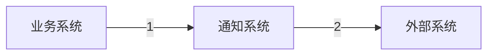
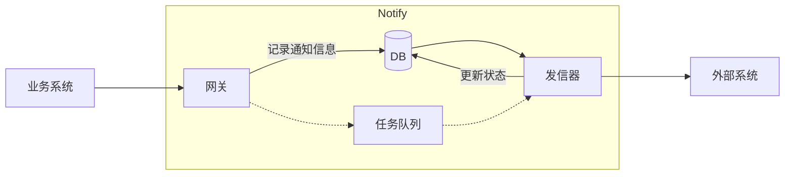

# API Notification System

## 问题理解

典型场景如下：

通知系统需要根据客户注册的 webhook 进行通知回调。整个过程中，业务系统只需要在 1 中关注是否成功触发事件通知，事件是否成功送达由通知系统在 2 中保证。

此外需要关注的点主要有：
1. 消息需要保证传递成功，因此考虑采用「至少一次」的投递策略。由于消息成功投递可能不止一次，则需要考虑消息去重的问题。
2. 消息投递失败的情况，需要考虑重试策略。对于多次投递失败，则需要告警通知人工介入。
3. 针对不同客户注册的请求体可能不同的情况，需要有一个请求体模板映射，以便于组装消息通知请求。
4. 需要考虑消息投递的实时性要求高的场景，系统需要可扩展。

## 整体架构与核心设计

整体架构如下：

上述架构中，DB、任务队列两个部分需要进行模块封装，以实现模块的可扩展和可插拔。其中，DB 用于元信息持久化和状态记录，在 MVP 版本中可以考虑使用 Sqlite；任务队列可以只实现逻辑，在业务规模上涨、消息投递实时性要求高的情形下再引入 Kafka 等中间件。

## 关键工程决策与取舍说明
